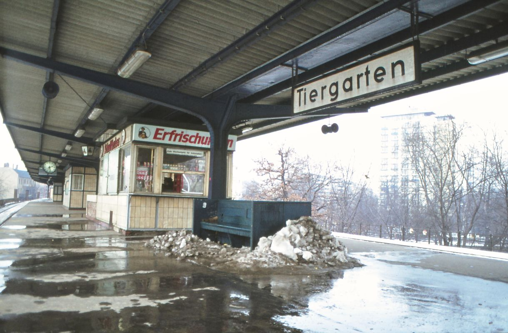
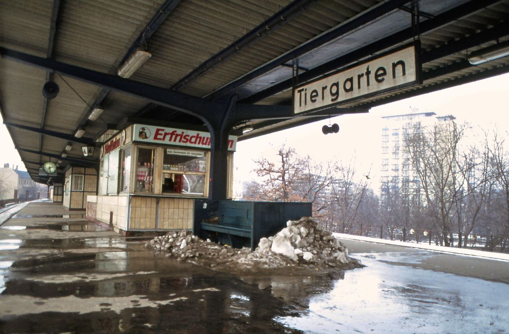

  

Enhance your scanned photos with professional precision.

  
  
  
  
  
  
  

RetroShine intelligently restores color and contrast to digitized analog photos — clean, accurate, and built for photographers and archivists. Historically faithful, refined for today's standards.

|  |  |
|--------|-------|
| Before | After |

## Key Features

- **🧠 Auto Correction** - Intelligent curve adjustment based on image content
- **🛠️ Manual Control** - Advanced tools for perfect results
- **⚡ Batch Processing** - Process entire folders at once
- **🖼️ Full Quality** - Preserves original resolution, compression, and EXIF metadata
- **🪄 Simple Interface** - No editing experience needed

## What RetroShine Fixes

### Recover Bleached Colors

Aged color films often suffer from dye bleaching and loss of contrast. RetroShine analyzes color spectrum and content to find the optimal correction curve for each channel. It rebalances the image to restore natural skin tones and vivid scenery without artifacts.

|  |  |
|--------|-------|
| Before | After |

### Restore Underexposed Photos

Underexposed photos are often developed longer to compensate for darkness. This leads to artificially high black points. RetroShine's advanced algorithm detects this and carefully adjusts shadows and highlights, revealing hidden details without producing glow effects.

|  |  |
|--------|-------|
| Before | After |

### Scanner Software vs. RetroShine

All examples above were produced with the same settings, running Retroshine in full-auto mode. Standard scanner software features automatic correction functions that often fail to produce consistent results. We developed RetroShine to avoid the time-consuming tinkering with consumer-level scan and editing software. Let RetroShine's algorithm take over, you have better things to do!

|  |  |
|------------------|------------|
| Scanner Software | RetroShine |

## Pro Workflow

For maximum quality, you can leverage RetroShine's full capacity by processing raw 16-bit scans (PNG or TIFF). You can load your scanner's ICC profile into RetroShine for best results. It will convert the images to sRGB after curve corrections to avoid any channel bleeding.

While RetroShine aims at ease of use, its underlying AutoLevels engine is a command-line tool that seamlessly fits into professional automated archiving workflows. Perfect for museums, archives, and professional photographers.

**[Learn About AutoLevels](https://github.com/yellowdolphin/autolevels)**

|  |  |  |
|----------|----------------------------|-------------------|
| Raw Scan | Automatic Curve Correction | Final sRGB Output |

## Ready to Bring Your Photos to Life?

No subscriptions. No ads. No data collection. Your privacy is guaranteed.

**[Download for Desktop](https://retroshine.eu/download.html)** | **[Try Web App](https://web.retroshine.eu)**

## Resources

- **Website**: [https://retroshine.eu](https://retroshine.eu)
- **FAQ**: [https://retroshine.eu/faq.html](https://retroshine.eu/faq.html)
- **Tutorial**: [https://retroshine.eu/tutorial.html](https://retroshine.eu/tutorial.html)
- **Contact**: [contact@retroshine.eu](mailto:contact@retroshine.eu)
- **Donate**: [https://retroshine.eu/donate.html](https://retroshine.eu/donate.html)

## Legal

- [Privacy Policy](https://retroshine.eu/privacy_policy.html)
- [Legal Notice](https://retroshine.eu/legal_notice.html)

---

© 2025 RetroShine team. All rights reserved.
